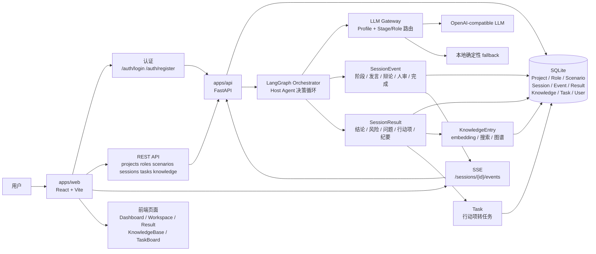

# Astra AI

多 Agent 协同编排与任务执行平台。当前实现重点是智能研讨 Session 的后端编排、前端演示闭环、知识沉淀和结构化任务交付。

- 前端生产站点：`https://astra.wlait.com`
- 后端 API：`https://astra-api.wlait.com`
- Monorepo：`apps/api`、`apps/web`、`openspec`

## 最新进展

- 后端已从 MVP 演进为完整 FastAPI 服务，提供认证、API Key/JWT 保护、限流、安全头、项目/角色/场景管理、Session 编排、SSE、结构化结果、知识库、任务管理和模型 Profile API。
- Session 由 Host Agent 决策循环推进，支持阶段跳过/新增、角色调整、知识检索、人审暂停、结构化辩论事件和最终结果沉淀。
- LLM Gateway 支持默认模型、模型 Profile、Stage/Role 路由和 Session 覆盖；远程模型异常时可使用本地确定性 fallback，保证演示闭环可完成。
- 前端 React/Vite 已接入真实 REST/SSE 数据流，覆盖登录注册、Dashboard、发起研讨、Workspace、结果页、历史页、项目/角色配置、知识库和任务看板。
- 数据闭环已打通：`SessionResult` 可自动沉淀为 `KnowledgeEntry`，结果行动项可提升为 `Task`，知识库支持搜索、相似案例推荐和图谱展示。
- 工程化已具备 CI，覆盖后端 pytest、前端 Vitest、前端构建和 OpenSpec 严格校验。

## 架构



## 目录

- `apps/api`：FastAPI 后端，SQLModel + SQLite + LangGraph + SSE。
- `apps/web`：React + Vite + TypeScript 前端。
- `openspec`：当前规格与历史变更文档。
- `docs`：部署、运维和补充说明。

## 主要 API 能力

- 基础与认证：`GET /health`、`POST /auth/register`、`POST /auth/login`。
- 项目、角色、场景：`/projects`、`/agent-roles`、`/scenario-templates`。
- 智能研讨：`/sessions`、`/sessions/{session_id}`、`/sessions/{session_id}/events`、`/sessions/{session_id}/result`。
- 人工确认与结果转任务：`POST /sessions/{session_id}/human-reviews/{review_id}/respond`、`POST /sessions/{session_id}/promote-actions`。
- 模型与知识库：`/models/profiles`、`/models/test`、`/knowledge/search`、`/knowledge/similar`、`/knowledge/entries`、`/knowledge/graph`。
- 任务管理：`/tasks`，支持创建、列表、详情、更新、删除和按项目/状态/优先级筛选。

除健康检查和登录注册外，业务 API 默认需要认证。

## 本地开发

```bash
npm install
npm --prefix apps/web install
npm run dev          # 同时启动 API(:8010) + Web(:5173)
npm run dev:api      # 仅 API
npm run dev:web      # 仅 Web
```

前端默认连接 `http://127.0.0.1:8010`，可通过 `VITE_API_BASE_URL` 覆盖。

## 测试与校验

```bash
npm run test:api                # 后端 pytest
npm --prefix apps/web run test  # 前端 Vitest
npm --prefix apps/web run build # 前端构建
npx openspec validate --strict  # OpenSpec 严格校验
```

当前测试文件规模：后端 11 个 pytest 文件，前端 5 个 Vitest 测试文件。

## 后端配置

常用环境变量均使用 `ASTRA_` 前缀：

```bash
ASTRA_DATABASE_URL=sqlite:///./data/astra.db
ASTRA_API_KEY=<api-key>
ASTRA_JWT_SECRET=<jwt-secret>
ASTRA_ADMIN_PASSWORD=<admin-password>
ASTRA_CORS_ORIGINS=https://astra.wlait.com
ASTRA_RATE_LIMIT_ENABLED=true

ASTRA_LLM_BASE_URL=https://api.openai.com/v1
ASTRA_LLM_API_KEY=<llm-api-key>
ASTRA_LLM_MODEL=gpt-4o-mini
ASTRA_LLM_TIMEOUT_SECONDS=60
ASTRA_LLM_MODEL_PROFILES='{"default":{"model":"gpt-4o-mini"},"strong":{"model":"gpt-4o"}}'
ASTRA_LLM_STAGE_ROUTING='{"debate":"strong","judge_and_summarize":"strong"}'
ASTRA_LLM_ROLE_ROUTING='{}'

ASTRA_EMBEDDING_BASE_URL=https://api.openai.com/v1
ASTRA_EMBEDDING_API_KEY=<embedding-api-key>
ASTRA_EMBEDDING_MODEL=text-embedding-3-small
```

未配置远程 LLM 时，Session 使用本地确定性 fallback。未配置 embedding 时，知识库仍可通过文本检索降级工作。

## 部署说明

前端部署在 Vercel，`apps/web` 是 Root Directory，生产环境需要配置：

```bash
VITE_API_BASE_URL=https://astra-api.wlait.com
```

后端生产服务默认通过 Docker Compose 暴露 `127.0.0.1:8010:8010`，数据目录挂载为 `./data:/app/data`。云服务器上的后端更新流程见 [docs/backend-update.md](docs/backend-update.md)。

## 安全说明

- 不要在仓库提交真实密钥、令牌、私钥、服务器账户、生产 `.env` 或内网地址。
- 生产配置请使用环境变量、服务器私有文件或密钥管理服务注入。
- 运维细节、备份策略和故障处理 SOP 应放在私有文档系统中维护。
